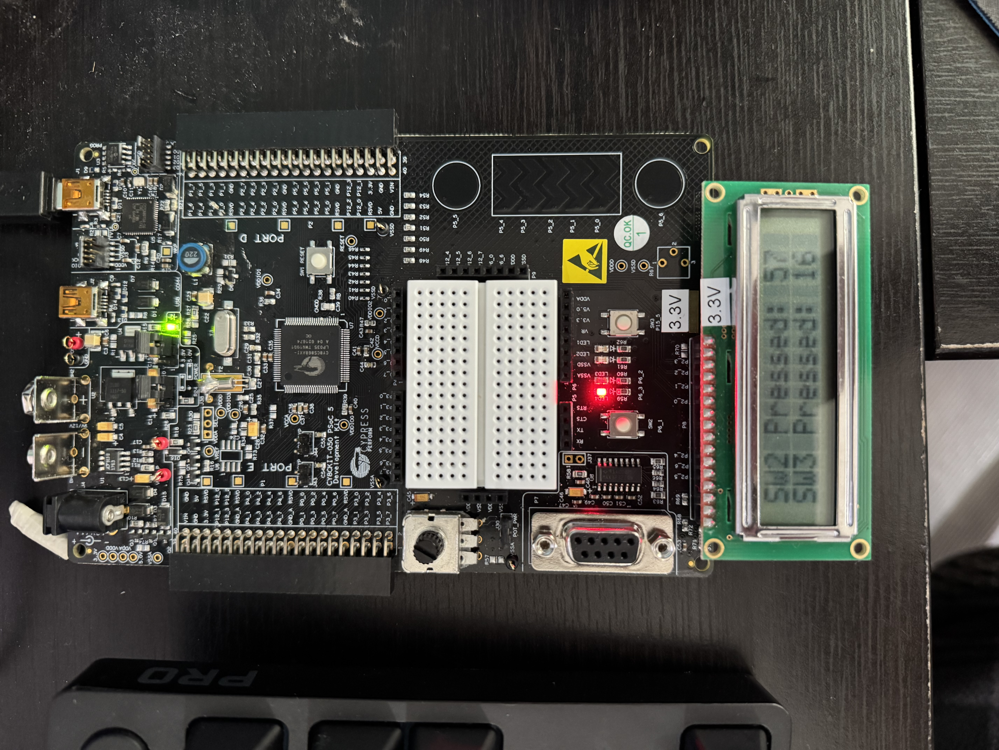
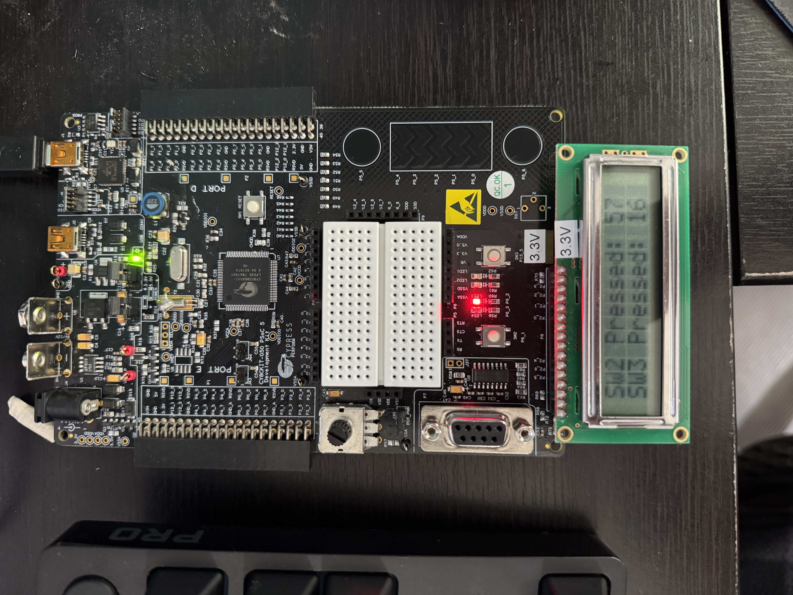

# Multi-Rate Interactive State Machine Embedded Controller

An embedded interactive control system built for the Cypress PSoC 5LP platform. The project features an asynchronous software scheduling engine running non-blocking tasks to manage real-time UI text scrolling, dynamic switching cycles, and a dual-channel LED array.

---

## Technical Highlights & Features
* **Asynchronous Task Scheduler:** Engineered a custom non-blocking scheduler in C ensuring zero processor freezes while concurrently running LCD scrolling, LED frequency loops, and input tracking.
* **State Machine & Control System:** Features runtime state tracking to manage alternating "railroad-style" blinking sequence.
* **Interactive Controls:**
  * **Freeze Mode:** Pause execution mid-sequence on individual lights (LED3 or LED4).
  * **Event Tally Counter:** Real-time button-press logging displayed live on the LCD dashboard.
  * **Emergency Stop (Kill Switch):** Immediate system halt mechanism via push-button trigger (`SW3`).

---

## Hardware Architecture & Hardware Mapping
* **Microcontroller:** Cypress PSoC 5LP (CY8CKIT-050 Development Kit)
* **Language:** C / PSoC Creator API
* **Peripherals:** Character LCD (16x2), Pushbuttons (`SW2`, `SW3`), Dual-Channel LED Array (`LED3`, `LED4`)

### Schematics & Pin Assignment

---

## Project Hardware Results

| LED State 1 | LED State 2 |
| :---: | :---: |
|  |  |
